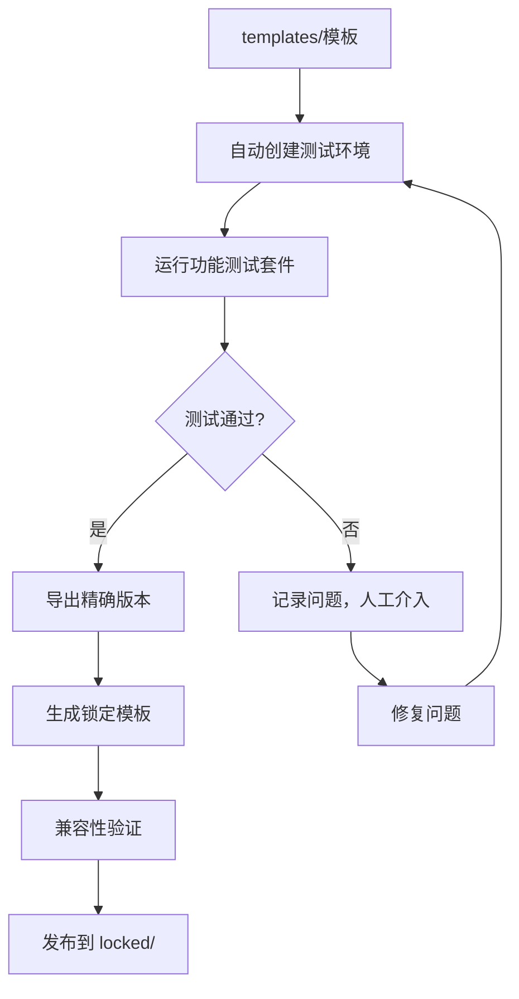

# Conda 环境管理策略

## 📋 概述

本目录提供了一套完整的 conda 环境模板管理方案，通过多层次架构解决环境管理中的核心挑战。

## 🔺 不可能三角问题

在 conda 环境管理中存在一个经典的"不可能三角"问题：

```
        灵活性 (Flexibility)
       /                    \
      /                      \
     /                        \
    /                          \
可重现性 ←――――――――――――――――→ 维护性
(Reproducibility)        (Maintainability)
```

### 三角关系分析

| 目标 | 含义 | 具体要求 |
|------|------|----------|
| **灵活性** | 适应多种需求 | 多 Python 版本、版本范围、场景适配 |
| **可重现性** | 结果一致性 | 相同输入→相同输出、环境无漂移 |
| **维护性** | 管理成本低 | 文件数量少、更新简单、测试容易 |

### 冲突分析

- **灵活性 ↔ 可重现性**: 版本范围提供灵活性但损害可重现性；精确版本保证可重现性但失去灵活性
- **灵活性 ↔ 维护性**: 支持多版本需要维护更多文件；单一模板无法支持多版本需求
- **可重现性 ↔ 维护性**: 精确版本矩阵维护成本高；简化配置无法保证完全可重现性

## 🎯 取舍策略

### 策略选型分析

在确定最终方案前，我们分析了行业中的主流策略：

#### 行业方案对比

| 策略类型 | 代表工具 | 优先级 | 适用场景 | 优缺点 |
|----------|----------|--------|----------|--------|
| **可重现优先** | Docker, Nix | 可重现性 > 维护性 > 灵活性 | 生产部署、关键系统 | ✅ 完全可控 ❌ 开发不便 |
| **灵活性优先** | pip+requirements | 灵活性 > 维护性 > 可重现性 | 快速原型、个人项目 | ✅ 开发便捷 ❌ 环境漂移 |
| **平衡策略** | Poetry, Pipenv | 灵活性 ≈ 可重现性 > 维护性 | Python 项目开发 | ✅ 双文件机制 ❌ 维护成本高 |
| **维护优先** | conda-forge | 灵活性 > 维护性 > 可重现性 | 科学计算社区 | ✅ 社区维护 ❌ 版本滞后 |

#### 策略选择依据

**用户群体权重分析:**
```
开发者 (40%) + 研究者 (30%) + 企业用户 (30%)

需求优先级计算:
- 灵活性: 40% × 高 + 30% × 中 + 30% × 低 = 中高
- 可重现性: 40% × 中 + 30% × 高 + 30% × 高 = 高  
- 维护性: 40% × 低 + 30% × 中 + 30% × 中 = 中

综合权衡: 灵活性 ≈ 可重现性 > 维护性
```

**场景需求分析:**
- **开发者**: 需要快速迭代和多版本支持（灵活性）
- **研究者**: 需要实验可重现和结果可信（可重现性）
- **企业用户**: 需要生产稳定和团队一致（可重现性）

**最终选择: 灵活性优先 + 分层保证可重现性**

理由：
1. 大部分使用场景需要灵活性（开发、测试、原型）
2. 关键场景通过锁定层保证可重现性（生产、发布、重要研究）
3. 通过自动化控制维护成本

#### 替代方案

如果需求发生变化，可考虑以下替代策略：

**方案A: 可重现性优先**
- 适用：企业比例增加到 60% 以上
- 实现：只提供锁定模板，按月更新
- 权衡：牺牲开发灵活性，保证生产稳定

**方案B: 完全分离策略**  
- 适用：用户群体差异极大
- 实现：开发版和生产版完全独立
- 权衡：维护成本显著增加

**方案C: 社区驱动模式**
- 适用：用户基数达到临界点
- 实现：类似 conda-forge 的社区维护
- 权衡：失去版本控制权，依赖社区活跃度

### 优先级排序

基于用户群体分析（开发者 40% + 研究者 30% + 企业用户 30%）：

```
优先级：灵活性 > 可重现性 > 维护性
```

### 策略原则

1. **灵活性优先**: 满足快速开发和原型验证需求
2. **分层保证可重现性**: 为生产环境和关键研究提供锁定版本
3. **可控的维护成本**: 通过自动化和分层管理控制复杂度

## 📁 多层次模板架构

```
conda/environments/
├── 📁 templates/           # 灵活模板（开发测试）
│   ├── python-basic.yml    # 版本范围，追求灵活性
│   ├── datascience.yml     # 数据科学技术栈
│   ├── webdev.yml          # Web 开发环境
│   └── mlops.yml           # 机器学习运维
├── 📁 locked/              # 锁定模板（生产环境）  
│   ├── python-basic-py310-2024Q2.yml  # 精确版本
│   ├── datascience-py311-2024Q2.yml   # 季度更新
│   └── mlops-py39-2024Q2.yml
└── 📁 minimal/             # 最小模板（快速实验）
    ├── basic.yml           # 极简配置
    ├── ds-mini.yml         # 最小数据科学环境
    └── dev-mini.yml        # 最小开发环境
```

### 分层策略

| 层次 | 文件位置 | 特点 | 使用场景 |
|------|----------|------|----------|
| **灵活层** | `templates/` | 版本范围、快速迭代 | 开发测试、原型验证 |
| **锁定层** | `locked/` | 精确版本、季度更新 | 生产环境、团队协作、关键研究 |
| **极简层** | `minimal/` | 最少依赖、最快创建 | 快速实验、概念验证 |

### 使用接口

```bash
# 默认灵活模式（开发测试）
conda_create_from_template python-basic

# 指定版本（精确控制）  
conda_create_from_template python-basic my-env 3.10

# 锁定模式（生产环境）
conda_create_from_template python-basic my-prod --locked 2024Q2

# 极简模式（快速实验）
conda_create_from_template python-basic my-test --minimal
```

## 🛠️ 锁定模板生成策略

### 生成策略对比

在设计锁定模板生成方案时，我们评估了以下策略：

| 策略 | 优点 | 缺点 | 适用性 |
|------|------|------|--------|
| **手动创建** | 质量可控、经过验证 | 工作量大、容易过时 | 小规模项目 |
| **自动导出** | 效率高、版本最新 | 可能有兼容性问题 | 需要验证流程 |
| **CI/CD 生成** | 自动化、定期更新 | 复杂度高、需要基础设施 | 大规模项目 |
| **混合验证** | 平衡质量和效率 | 需要设计流程 | ✅ **最终选择** |

**选择理由**: 混合验证策略既保证了质量（通过测试验证），又实现了效率（自动化生成），维护成本可控。

### 混合验证流程



### 生成流程

#### 1. 自动环境创建

对每个 Python 版本（3.9, 3.10, 3.11）：
- 从 `templates/` 创建临时环境
- 解析依赖并安装包
- 记录创建过程和警告

#### 2. 功能测试套件

```python
# 核心包导入测试
def test_core_packages():
    packages = ['numpy', 'pandas', 'matplotlib', 'requests']
    for package in packages:
        importlib.import_module(package)

# 开发工具可用性测试  
def test_development_tools():
    tools = ['black', 'flake8', 'mypy', 'jupyter']
    for tool in tools:
        subprocess.run([tool, '--version'], check=True)

# 基本功能组合测试
def test_basic_functionality():
    # 数据处理 + 可视化流程测试
    pass
```

#### 3. 智能冲突处理

- **版本冲突检测**: 使用 `conda --dry-run` 预检测冲突
- **解决策略建议**: 基于包重要性和兼容性规则
- **自动降级/升级**: 在安全范围内自动调整版本

#### 4. 锁定文件生成

```yaml
# locked/python-basic-py310-2024Q2.yml
# 元数据
# Generated from: templates/python-basic.yml
# Python version: 3.10
# Quarter: 2024Q2  
# Generated: 2024-06-11T10:30:00
# Tested: ✅ All tests passed

name: python-basic-py310-2024Q2
channels:
  - conda-forge
  - defaults
dependencies:
  - python=3.10.12          # 精确版本
  - numpy=1.24.3            # 经过测试的稳定组合
  - pandas=2.0.1            
  - matplotlib=3.7.1
  # ... 其他精确版本
```

### 季度更新流程

```bash
# 自动化季度更新
1. 遍历所有 templates/ 模板
2. 为每个支持的 Python 版本生成锁定版本
3. 运行完整测试套件验证
4. 生成更新报告和变更日志
5. 发布新的锁定模板
```

### 质量保证机制

#### 多重验证
- **自动化测试**: 每个锁定模板都经过功能测试
- **兼容性验证**: 跨 Python 版本兼容性检查  
- **性能基准**: 环境创建时间和包导入速度
- **人工抽查**: 关键模板的人工验证

#### 回滚机制
```bash
# 版本回滚支持
conda_create_from_template python-basic --locked 2024Q1  # 回到上季度版本
conda_create_from_template datascience --locked 2023Q4   # 回到指定版本
```

## 📊 版本命名规范

### 锁定模板命名
```
{模板名}-py{python版本}-{年份}Q{季度}.yml

示例:
- python-basic-py310-2024Q2.yml
- datascience-py311-2024Q2.yml  
- mlops-py39-2024Q1.yml
```

### 元数据标准
每个锁定模板都包含：
- 源模板路径
- Python 版本
- 生成时间和季度
- 测试状态
- 变更说明

## 🔧 维护指南

### 新增模板
1. 在 `templates/` 创建新模板
2. 编写对应的测试套件
3. 运行生成脚本创建锁定版本
4. 验证所有 Python 版本兼容性

### 更新流程
1. 修改 `templates/` 中的模板
2. 运行回归测试
3. 重新生成锁定版本
4. 更新文档和示例

### 问题排查
1. 检查测试日志
2. 验证依赖冲突
3. 比较不同版本差异
4. 查看生成报告

---

通过这套多层次架构，我们在灵活性、可重现性和维护性之间取得了最佳平衡，为不同场景的用户提供了适合的解决方案。